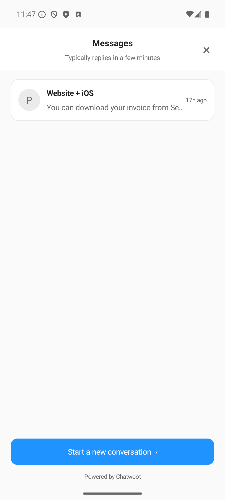
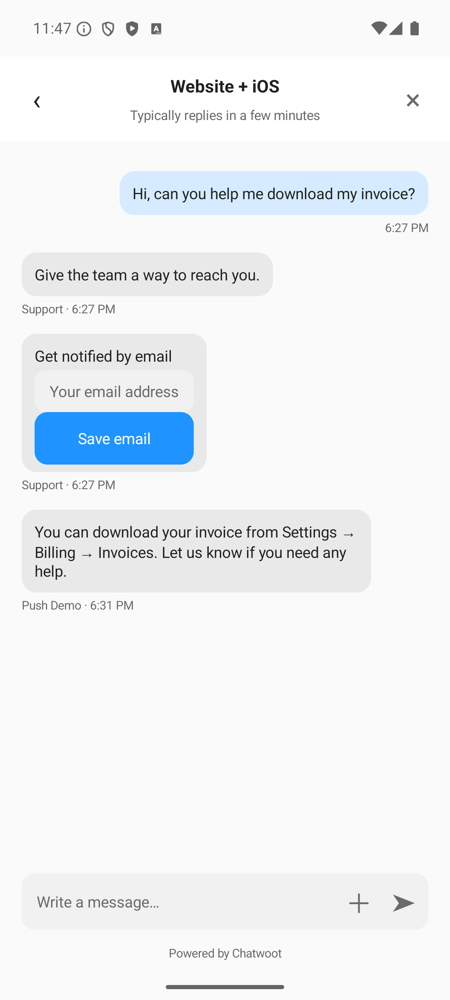

# Chatwoot Android SDK

Native in-app support for Android: connect customers to a Chatwoot Mobile app inbox using an SDK app ID. Includes a conversation list, chat UI, pre-chat form, attachments, live updates, and Firebase push integration.

This is an initial local preview. It requires the backend Mobile app channel changes; it is not yet published to Maven Central.

## Requirements

- Android 8.0 (API 26) or later.
- Java 17 to build this repository.
- A Chatwoot instance with a Mobile app channel created under Settings → Inboxes.
- Firebase configuration only if you need push notifications.

## Install locally

Include the library module in your app's `settings.gradle.kts`:

```kotlin
include(":chatwoot-sdk")
project(":chatwoot-sdk").projectDir = file("../android-sdk/sdk")
```

Add the project dependency to your app:

```kotlin
dependencies {
    implementation(project(":chatwoot-sdk"))
}
```

Your project needs the Android library and Kotlin Android plugins and the Google and Maven Central repositories. See this repository's build files for a working example. The SDK uses native Android views and can be launched from either a Views or Compose app.

## Open support

Create a **Mobile app** inbox under **Settings → Inboxes → Add inbox**, then copy its **SDK app ID** from the **Setup** tab. Create and reuse one client per inbox:

```kotlin
val client = ChatwootClient(
    context = applicationContext,
    baseUrl = "https://app.chatwoot.com",
    sdkAppId = "YOUR_SDK_APP_ID"
)
Chatwoot.showSupport(this, client)
```

The SDK reads the inbox's name, theme colour, reply time, branding and pre-chat form configuration. It stores the customer session using Android Keystore encryption in storage excluded from backups. API functions are suspending functions; call them from a coroutine.

For authenticated customers, compute the identifier signature on your backend using the inbox's identity validation secret:

```kotlin
client.identify(identifier = user.id, signature = signatureFromYourBackend,
    name = user.name, email = user.email)
```

Never embed the identity validation secret in the app. Call `client.reset()` and wait for completion when your customer signs out, before connecting another customer. This also unregisters the device. Register the FCM token again after a new connection or identity change.

## Push notifications

The host app owns Firebase and notification permission prompts. The SDK does not replace your existing `FirebaseMessagingService`.

1. Register your Android package in Firebase and add `google-services.json` to your app module. Apply the Google Services Gradle plugin and add Firebase Messaging.
2. Enable the Firebase Cloud Messaging HTTP v1 API. In Chatwoot, open Settings → Inboxes → Your mobile inbox → Push notifications → Android, and enter the package name and Firebase project ID. Upload the project's service account JSON key there. **Never put the service account key in the Android app or this repository.**
3. Call `Chatwoot.createNotificationChannel(context)` before receiving notifications. The channel ID is `chatwoot_support`.
4. On Android 13+, request `POST_NOTIFICATIONS` in your host app. The SDK declares the manifest permission but does not prompt automatically.
5. After connecting, retrieve `FirebaseMessaging.getInstance().token` and call `client.registerDeviceToken(token)`. Forward refreshed tokens from `FirebaseMessagingService.onNewToken` too. If registration fails, retry when your app next connects.
6. For notification taps, pass the intent's Chatwoot data to support:

```kotlin
val data = Chatwoot.notificationData(intent)
if (data.isNotEmpty()) Chatwoot.showSupport(this, client, data)
```

Handle this in both `onCreate` and `onNewIntent` of the host activity that receives notification taps. The SDK verifies the conversation belongs to the current customer before opening it.

Firebase displays background notification messages; the host's service handles foreground display. See [PushService.kt](example/src/main/java/com/chatwoot/example/PushService.kt) for the callback implementation. Payload data contains the SDK app, inbox and conversation IDs. The notification body is generic and does not contain the reply text.

Reference: [Firebase Android client setup](https://firebase.google.com/docs/cloud-messaging/android/client), [receiving messages](https://firebase.google.com/docs/cloud-messaging/android/receive), [HTTP v1 authentication](https://firebase.google.com/docs/cloud-messaging/send/v1-api).

## Run the example

Open this project in Android Studio, or run:

```sh
./gradlew :example:assembleDebug :sdk:lintDebug :example:lintDebug
adb install -r example/build/outputs/apk/debug/example-debug.apk
adb shell am start -n com.chatwoot.example/.MainActivity
```

Enter your Chatwoot URL and SDK app ID. For a server running on your Mac, the Android emulator normally uses `http://10.0.2.2:3127`. Alternatively, run `adb reverse tcp:3127 tcp:3127` and enter `http://localhost:3127`. The example permits local HTTP; production apps should use HTTPS.

Chat works without Firebase. To test real push delivery, add your Firebase Android configuration as `example/google-services.json` (ignored by Git), configure Android credentials in Chatwoot, rebuild, and enable notifications. Use the package name `com.chatwoot.example`. Send an agent reply while the app is in the background and tap the notification. An accepted FCM response alone does not prove the notification appeared.

## Initial scope

- Multiple conversations, history pagination and unread counts.
- Text messages, clickable links, file upload and attachment links.
- Configured pre-chat fields, including required fields and custom attributes.
- Email capture messages, anonymous or signed customer identity, and sign-out.
- Live updates while support is visible, reconnection and refresh on return.
- Inbox theme colour and branding settings.
- FCM device registration and verified notification navigation.

Rich cards, surveys/CSAT, typing indicators, inline image previews, complete Markdown rendering and localisation are not included yet. There is no offline send queue; errors stay visible so the customer can retry. Real background FCM delivery and notification navigation have been verified on an Android emulator. Physical-device, cold-launch, token-refresh and logout/account-switch checks remain before release.

## Screenshots

| Conversations | Chat |
| --- | --- |
|  |  |
